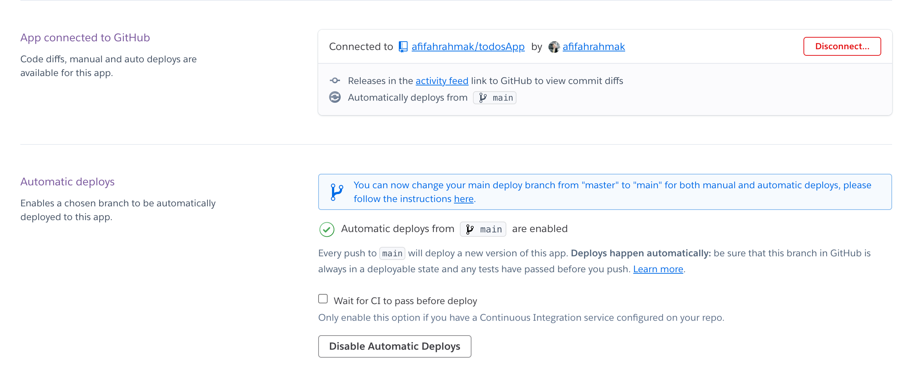

# Deployment Simple web app in Heroku via Github

This is a quick tutorial explaining how to get a static website hosted on Heroku.

**Why do this?**

Heroku hosts *apps* on the internet, not static websites. To get it to run your static portfolio, personal blog, etc., you need to trick Heroku into thinking your website is a PHP app. This 6-step tutorial will teach you how.

## Basic Assumption
- You want to deploy some straight-up HTML, CSS, JS, maybe a few images. Nothing fancy here.
- You are in the root directory of your site (i.e. the directory that contains all subdirectories and files for the site)
- The root directory contains a main HTML page, e.g. index.html
- A [Heroku app](https://devcenter.heroku.com/articles/quickstart) and remote are set up and ready to go

## Steps

1. create repository in GitHub your app name (Example : `todosApp`).
1. clone the repository with `git clone <paste-url-repo>`.
1. open the folder after clone in vscode.
1. create your apps in the folder. with outline html :
    - index.html / home.html
    - contact.html
    - about.html
    - portofolio.html
    - blog.html
    - todos.html
1. add any file ___*.css___ & ___*.js___ as required in your app.
1. add a file *composer.json* to the root folder
1. In *composer.json*, add the following line: `{}`
1. Add a file called *index.php* to the root folder
1. In *index.php*, add the following line: `<?php include_once("home.html"); ?>` or `<?php include_once("index.html"); ?>`
1. When the work is complete, execute the following commands:
   - `git add .`
   - `git commit -m '<message-commit>'`
   - `git push -u origin master` or `git push -u origin main`
1. visit your repository in github, if uploaded go to heroku website and login.
1. klik new, choose **create new app**.

   

1. type your app name in the form, it will be the address of your app, so it must be unique. if the name is available clik **create app**

   

1. at tab _Deploy_, go to _Deployment method_ section and choose **Github**

   

1. you'll be directed to the another page for authorizing your github account with heroku, click **Authorized heroku**

   
   

1. in section _Connect to Github_, search your repository appName and click **connect** until the section change to _App connected to Github_

   
   

1. to finish the step you have to click **deploy branch** in the section _Manual deploy_

   

1. your app has built and delployed to heroku, clcik **view** button, you can access your app in `<your-app-name>.herokuapp.com`.

